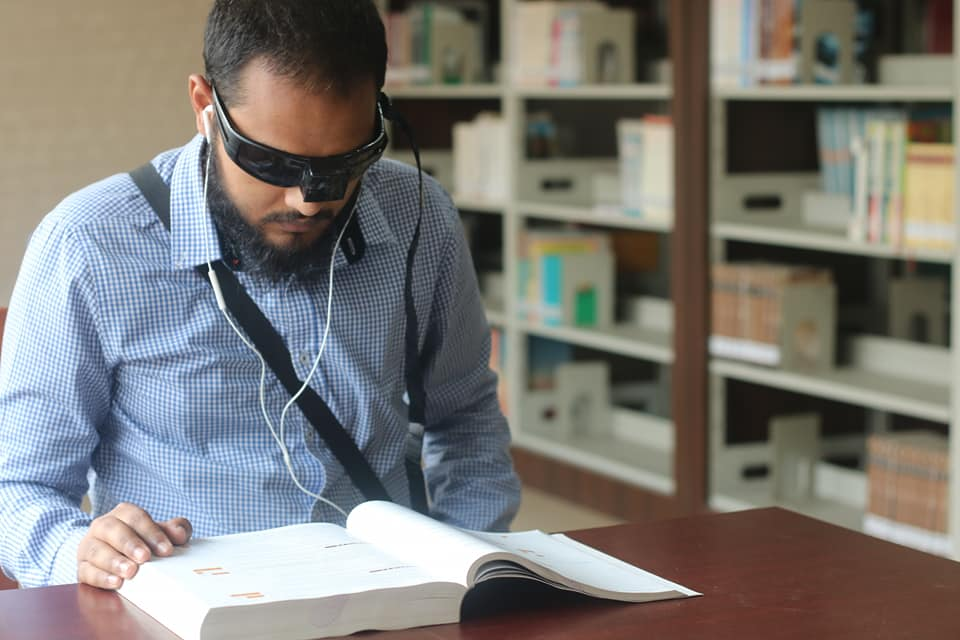

# Smart Eye-Glass-for-Visually-Impaired-People-Using-Raspberry-Pi
 (Final year project)
 
Smart eyeglass for visually impaired people can improve mobility as well as the safety of visually impaired people. The aim of this work is to build a smart guiding device that can help visually impaired people to detect and recognize objects with the location of the objects,walk alone and recognize face of the known people. Then the information is sent to the visually impaired people by voice instruction. In addition, this device reads any printed text and converts it into speech. User can change the features using switches. This device will assist the blind and partially sighted people in the known and unknown environment without the help of other persons.

Technologies used:
  - Tensorflow object detection api
  - Python
  - Machine Learning 
  - OCR
  - Camera Module
  - Respberry pi B 3
